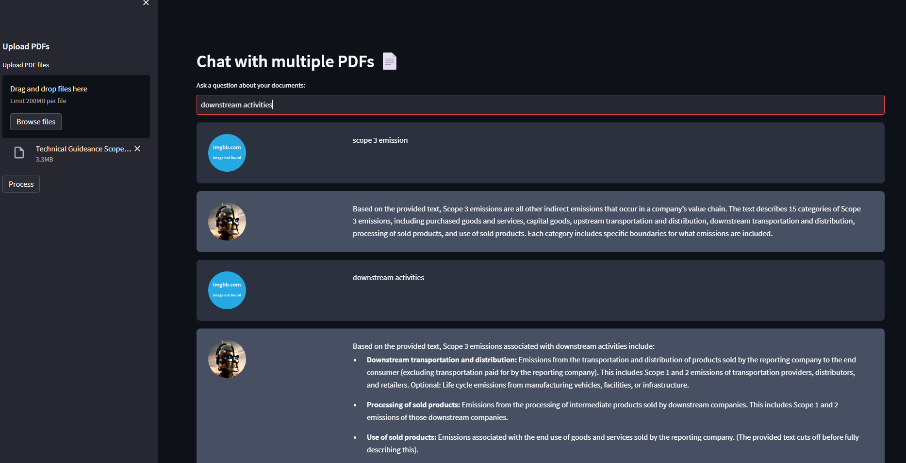

# Gemini-Powered Multi-PDF Chatbot

This application allows users to upload and interact with multiple PDF documents through a conversational interface. It uses **Google Gemini 1.5** for intelligent response generation and integrates Retrieval-Augmented Generation (RAG) techniques to provide page-specific answers based on the uploaded content. If a user query falls outside the scope of the uploaded documents, the app seamlessly falls back to Gemini’s general knowledge.



---

## Key Features

- Support for multiple PDF uploads.
- Real-time conversational interface with response streaming.
- Automatic PDF summarization upon upload.
- General knowledge fallback for queries beyond the PDF content.
- OCR support for scanned/image-based PDFs.
- Prompt templating to improve response quality and consistency.
- Session-based chat history with option to clear conversation.
- Graceful error handling and LLM quota monitoring.

---

## How It Works

1. **PDF Parsing**: The app reads and extracts text from uploaded PDFs using `PyMuPDF` and applies OCR (via `pytesseract`) where necessary.
2. **Chunking & Embedding**: Extracted content is chunked and embedded using `thenlper/gte-small` via HuggingFace.
3. **Vector Store**: Chunks are stored in a FAISS vector store for efficient similarity search.
4. **Query Handling**:
   - If relevant content is found: Gemini generates an answer referencing the matched chunk(s) and their page numbers.
   - If not: Gemini responds using its general knowledge.
5. **Streaming Chat Interface**: Answers are displayed through a Streamlit interface with persistent session chat history.

---

## Dependencies and Installation

To install the MultiPDF Chat App, please follow these steps:

1. Clone the repository to your local machine.
2. Install the required dependencies by running the following command:
   ```bash
   pip install -r requirements.txt
4. Obtain an API key from OpenAI and add it to the .env file in the project directory.
   ```bash
   GEMINI_API_KEY=your_secrit_api_key

---

## Usage

To use the MultiPDF Chat App, follow these steps:

1. Ensure that you have installed the required dependencies and added the GEMINI API key to the .env file
2. Run the final.py file using the Streamlit CLI. Execute the following command:
    ```bash
    streamlit run final.py   
3. The application will launch in your default web browser, displaying the user interface.
4. Load multiple PDF documents into the app by following the provided instructions.
5. Ask questions in natural language about the loaded PDFs using the chat interface.
